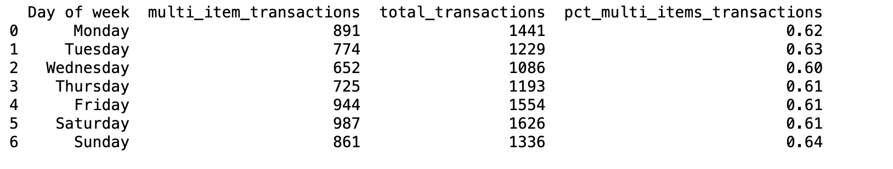
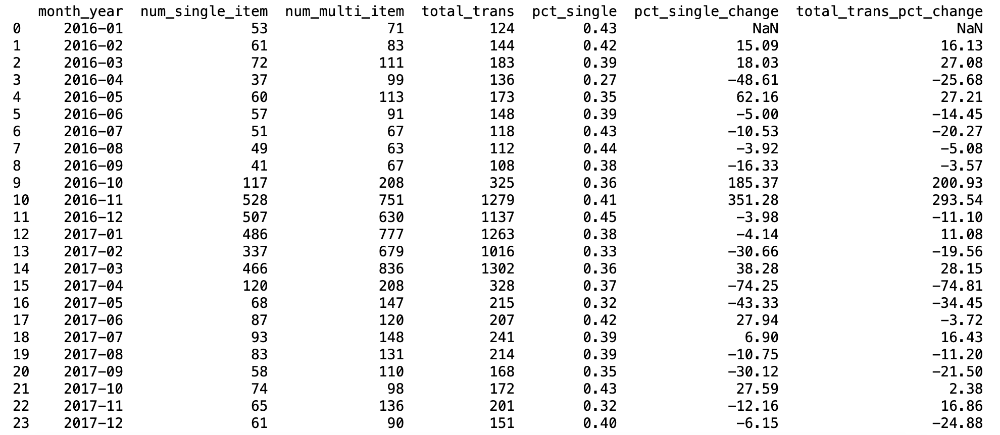

``` python
import pandas as pd
import numpy as np
import seaborn as sns
import matplotlib.pyplot as plt

bakery = pd.read_csv("downloads/bakery.csv")
bakery.head(50)

print(bakery.info())
```
### Original dataset 


#### Looking at the info() above, things to take note
- All the data fields are supposedly filled, no NA values
- 'DateTime' column needs to be converted from Object to Datetime
- There seems to be duplicate rows
- DayType seems to be incorrect e.g. dates that are Sunday are mislabelled as weekend (added this in after date manipulation futher below. Will rectify in earlier part of code)
-------------------
#### Convert "DateTime" column
- Converts the DateTime column to a datetime format for consistent processing.
- Creates a new column, DayType_new, to classify days as Weekday or Weekend based on the day of the week.
- Extracts and organizes date components:
  -  Month: Formatted as abbreviated names and ordered chronologically.
  - Date: Extracted as the specific calendar date.
  - month_year: Represents the month and year as a period for grouped analysis.
    
```python
bakery["DateTime"] = pd.to_datetime(bakery["DateTime"])

# added this code to address issue 4. above
bakery["DayType_new"] = np.where(bakery["DateTime"].dt.dayofweek < 5, 'Weekday', 'Weekend')

# add exrtact date, months and years from DateTime column
bakery["Month"] = bakery["DateTime"].dt.strftime("%b")
month_order = ["Jan", "Feb", "Mar", "Apr", "May", "Jun", "Jul", "Aug", "Sep", "Oct", "Nov", "Dec"]
bakery["Month"] = pd.Categorical(bakery["Month"], categories=month_order, ordered=True)
bakery["Date"] = bakery["DateTime"].dt.date
bakery["month_year"] = bakery["DateTime"].dt.to_period("M")
bakery.info()

```


#### Inspect duplicate rows

- Using duplicated() and groupby() function, inspect the duplicate counts.
- If there are irregular counts of duplicates, I will assume that the data is **NOT** a duplicate, but rather an order for >1 of an item in a transaction (e.g. 2 Scandinavian in TransactionNo 2)

``` python
duplicate_rows = bakery[bakery.duplicated(keep=False)]
duplicate_rows['Duplicate Count'] = duplicate_rows.groupby(list(duplicate_rows.columns)).transform('size')

unique_duplicates = duplicate_rows['Duplicate Count'].unique()

if np.array_equal(unique_duplicates, [2]):
    print("Yes, the data most likely are showing up as duplicates")
else:
    print(f"There are values showing up in {', '.join(map(str, unique_duplicates))} rows.\nIt can be assumed that the duplicated rows are not duplicates but rather items in same transaction.")
```
------------
------------

### 1. What are the Top 5 most popular products and categories?
Solution:

1. Use value_counts() to get count of items, sort by descending Total count
2. Use iterrows(), get a string of top 5 from sorted data

``` python
# Count the occurrences of each unique item in the 'Items' column and reset the index to create a DataFrame
popular_item = bakery.value_counts("Items").reset_index().rename(columns = {"count":"No. purchased"})

# Rename the column "count" to "No. purchased" for better readability
popular_item_str = ', '.join(f"{row['Items']}" for _, row in popular_item.head(5).iterrows())

print(f"The Top 5 most popular items are: {popular_item_str}.")

```
##### Result: 


-------

### 2. How do sales vary by day of the week and time of the day?
Solution:
1. Create columns for 'day of week' & 'hour of day' using *datetime*
2. Make days ordered in calendar day order (instead of alphabetical) by using *Categorical day_order*

```python
# Define the order of days of the week for consistent sorting
day_order = ["Monday", "Tuesday", "Wednesday", "Thursday", "Friday", "Saturday", "Sunday"]

# Create a new column 'Day of week' in the dataset, categorize days based on the defined order
bakery["Day of week"] = pd.Categorical(bakery["DateTime"].dt.day_name(), categories=day_order, ordered=True)

# Group the data by 'Day of week', count the number of records for each day, reset the index, and sort by the count in descending order
sales_by_day = bakery.groupby("Day of week").size().reset_index().sort_values(by = 0, ascending = False)

# Format the sales data into a string that lists each day and its respective count of sales
sales_by_day_str = '\n '.join(f"{row['Day of week']}: {row[0]}" for _,row in sales_by_day.iterrows())

# Print the order of days based on the number of sales, from most to least
print(f"Order of days from most to least sales:\n {sales_by_day_str}")
```
##### Result: 


- Extract the hour from the DateTime column and group the bakery transactions by both Day of week and hour of day.
- Calculate the number of transactions for each combination and sort the results chronologically by day and hour.

``` python
bakery["hour of day"] = bakery["DateTime"].dt.hour
transactions_per_hour_day = bakery.groupby(["Day of week", "hour of day"]).size().reset_index().sort_values(by=["Day of week", "hour of day"], ascending = [True, True])

transactions_per_hour_day.head(50)
```
##### Result: 


#### Plot graph for visualisation 

``` python
sns.set(style="whitegrid")
cud_palette = ["#E69F00", "#56B4E9", "#009E73", "#F0E442", "#0072B2", "#D55E00", "#CC79A7"]

# Plot the line graph
plt.figure(figsize=(12, 8))
sns.lineplot(
    data=transactions_per_hour_day, 
    x="hour of day", 
    y=0,  
    hue="Day of week",  
    palette=cud_palette,
    marker="o"
)

plt.xticks(range(24))  
plt.xlabel('Hours of the day')
plt.ylabel('Number of transactions')
plt.title('Transactions throughout a day')

plt.grid(alpha=0.4)

plt.show()
```
#### Graph:
Graph to show number of transactions across the week. 


#### Find the top 5 items sold per weekday 

``` python
# Group data by day of the week and items, then count the occurrences of each item
items_per_day = bakery.groupby(["Day of week", "Items"])["Items"].value_counts().reset_index().sort_values(by = ["Day of week", "count"], ascending = [True, False])

# Retrieve the top 5 items with the highest counts for each day of the week
top_5_items_per_day = items_per_day.groupby("Day of week").head(5)

# Filter transactions to include only those after 6 AM and group by day, hour, and items
items_per_day_hour = bakery[bakery["hour of day"] > 6].groupby(["Day of week", "hour of day", "Items"])["Items"].value_counts().reset_index().sort_values(by = ["Day of week","count"], ascending = [True, False])

```


#### Plot frequency chart of top 5 items

``` python
plt.figure(figsize=(10, 6))
sns.countplot(data=top_5_items_per_day, x='Items', palette='viridis')
plt.title("Frequency of Item appearing in Top 5 sales of each day")
plt.xlabel("Items")
plt.ylabel("Frequency")
plt.xticks(rotation=45)


plt.show()
```


#### Number of items per order
Analyze the number of items ordered per transaction and provide a summary of the total number of unique transactions. 
``` python
# analyze the number of items ordered per transaction.
transaction_counts = bakery["TransactionNo"].value_counts()
bakery["Num of items in transaction"] = bakery["TransactionNo"].map(transaction_counts)
print(bakery)

unique_trans = bakery["TransactionNo"].unique()
print(f"\nThere are a total of {len(unique_trans)} transactions.")
```


#### Analyze single item transactions
- This analysis focuses on single-item transactions to identify the most frequently purchased items across different days of the week.
- It calculates the proportion of each item in these transactions and visualizes the data using a bar chart.
- This helps identify trends in customer behavior and supports decisions on inventory, promotions, and sales strategies.

``` python

# Filter transactions that contain only a single item
single_items = bakery[bakery["Num of items in transaction"] == 1]

# Count the number of single-item transactions.
num_single_orders = (single_items['TransactionNo'].count())

# Calculate the total number of transactions in the dataset
total_orders = bakery['TransactionNo'].nunique()

print(f"There are {total_orders} total transactions.\n"
      f"There are {num_single_orders} transactions with single-item orders.\n"
      f"{num_single_orders / total_orders * 100:.2f}% of total transactions are single item orders.\n\n")
```


``` python
# Calculate the proportion of each item ordered for each day of the week
pct_items = bakery.groupby("Day of week")["Items"].value_counts(normalize = True).reset_index()

# Extract the top 5 items (by proportion) for each day of the week
pct_items_top_5 = pct_items.groupby("Day of week").head(5)

# Plot a line graph showing the proportion of the top 5 items in single transactions by day of the week
plt.figure(figsize=(12,8))
sns.lineplot(
    data = pct_items_top_5,
    x = 'Day of week',
    y = 'proportion',
    hue = 'Items'
)

plt.title("Percentage of item in single transactions")

# Customize the y-axis ticks to display percentages (0% to 50% in 10% intervals)
plt.yticks(np.arange(0, 0.6, 0.1), labels=[f'{int(i * 100)}%' for i in np.arange(0, 0.6, 0.1)])

plt.show()
```


#### Analysis of Multi-Item Transactions by Day of the Week
- Analyze the proportion of multi-item transactions per day.
- It calculates the percentage of transactions with more than one item for each day of the week
- Visualisation of the results in a bar chart.

``` python

# Find out how many transactions have more than 1 item each day 

multi_items = bakery[bakery["Num of items in transaction"] >1]
multi_items_by_day =  multi_items.groupby("Day of week").agg({"TransactionNo": "nunique"}).reset_index()

# number of transactions per day
num_transactions_per_day = bakery.groupby("Day of week").agg({"TransactionNo":"nunique"}).reset_index()

# merge tables and calculate percentage of transactions that are multi items per day
merged_multi_items = pd.merge(multi_items_by_day,num_transactions_per_day, on="Day of week", how="inner")
merged_multi_items = merged_multi_items.rename(columns={
    "TransactionNo_x": "multi_item_transactions",
    "TransactionNo_y": "total_transactions"
})
merged_multi_items["pct_multi_items_transactions"] = (merged_multi_items["multi_item_transactions"] / merged_multi_items["total_transactions"]).round(2)

print(merged_multi_items)

```


Plot graph for visualisation

``` python
# plot a bar graph showing percentage of multi item orders across the week 
plt.figure(figsize = (12,8))
bar_plot = sns.barplot(
    data = merged_multi_items, 
    x = 'Day of week',
    y = 'pct_multi_items_transactions'
)

plt.title('Percentage of multi-item transactions across the week')
plt.xlabel('Day of week')
plt.ylabel('Percentage of multi-item transactions')
plt.xticks(rotation = 45)
plt.yticks(np.arange(0, 1.1, 0.1), labels=[f'{int(i * 100)}%' for i in np.arange(0, 1.1, 0.1)])

for p in bar_plot.patches:
    bar_plot.annotate(f'{p.get_height():.0%}',  # Format the height as a percentage
                      (p.get_x() + p.get_width() / 2., p.get_height()),  # Position at the center of the bar
                      ha='center',
                      va='bottom', 
                      fontsize=12, 
                      color='black', 
                      xytext=(0, 5), 
                      textcoords='offset points')  


plt.show()
```


#### Analyzing Monthly Transaction Trends and Changes

- Calculate Monthly Totals:
   - Total transactions, single-item transactions, and multi-item transactions are calculated for each month.
- Merge Datasets:
   - The results are combined into a single consolidated DataFrame for analysis.

- Add Percentages:
   - Compute the percentage of single-item transactions (`pct_single`) relative to total transactions.

- Track Changes: 
   - Calculate month-over-month changes for:
     - Single-item transaction percentage (`pct_single_change`).
     - Total transactions (`total_trans_pct_change`).

``` python
# get dataframes for analysis of monthly total, single-item and multi-item transactions

# monthly total transactions
total_monthly_transactions = bakery.groupby("month_year").agg({"TransactionNo":"nunique"}).reset_index()

# number of single-item transactions per month 
single_items_monthly = single_items.groupby("month_year")["TransactionNo"].size().reset_index()

# number of multi-item transactions per month
multi_items_monthly = multi_items.groupby("month_year").agg({"TransactionNo": "nunique"}).reset_index()

consolidated_monthly = pd.merge(single_items_monthly, multi_items_monthly, on = 'month_year', how = 'inner', suffixes = ('_single', '_multi')).merge(total_monthly_transactions, on = 'month_year', how = 'inner')
consolidated_monthly = consolidated_monthly.rename(
        columns = {
            'TransactionNo_single': 'num_single_item', 
            'TransactionNo_multi':'num_multi_item', 
            'TransactionNo':'total_trans'}
)

consolidated_monthly["pct_single"] = (consolidated_monthly["num_single_item"] / consolidated_monthly["total_trans"]).round(2)

# Add a column to compare change in single item orders & total transactions
consolidated_monthly["pct_single_change"] = (consolidated_monthly["num_single_item"].pct_change()*100).round(2)
consolidated_monthly["total_trans_pct_change"] = (consolidated_monthly["total_trans"].pct_change()*100).round(2)


print(consolidated_monthly)
```


#### Visually compare single-item transactions over time
- Create yearly subsets of data from `consolidated_monthly` based on the `month_year` column.
- Plot the percentage of single-item transactions (`pct_single`) for each year, comparing across months.

``` python
year_list = consolidated_monthly["month_year"].dt.year.unique()
yearly_sales = {}

# loop through unique years to create a dataframe of each year
for year in year_list:
    yearly_sales[f'sales_{year}'] = consolidated_monthly[consolidated_monthly["month_year"].astype(str).str.startswith(str(year))].reset_index(drop = True)
    

plt.figure(figsize = (10,6))


# plot each year by their months, to show comparison between each year by their months
for year, df in yearly_sales.items():
    sns.lineplot(
        data=df,
        x=df["month_year"].dt.month,  
        y="pct_single",
        label=year  
)

plt.title('Single item transactions by year')
plt.xticks(
    ticks=range(1, 13), 
    labels=pd.to_datetime([f'2020-{month:02d}-01' for month in range(1, 13)]).strftime('%b'),
    rotation=45
)
plt.xlabel('Months')
plt.ylabel('% of single item transactions')
plt.grid(True, color='gray', alpha=0.1)

plt.show()
```


